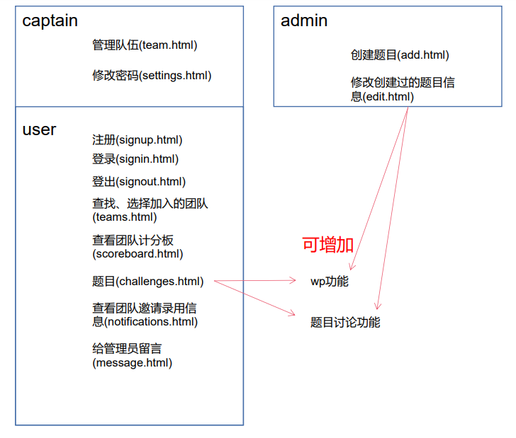

# EZBabyCTF

## 0. 小组成员

-   杜鑫：前端开发，人机交互
-   陆君睿：后端开发，功能实现
-   张靖宇：后端开发，题目搜集，效果测试

## 1. 项目概要设计

 仿照开源项目[ctfd](https://github.com/CTFd/CTFd)，利用HTML、JS、CSS、PHP、MySQL技术栈开发一个**全新的**能完成CTF日常练习基本功能的网站。经本组成员讨论研究决定要实现的功能包括但不限于：

-   普通用户：登录(signin.html)、登出(signout.html)、注册(signup.html)；查看并查找团队、可以选择加入的团队(teams.html)；查看团队计分板(scoreboard.html)；查看题目、下载附件、提交FLAG(challenges.html)；查看团队邀请录用信息(notifications.html)；给管理员留言(message.html)；修改密码(settings.html)
-   队长：在普通用户的基础上可以创建解散战队、对战队成员进行管理包括邀请新成员、删除无关成员(team.html)；修改密码(settings.html)
-   管理员：在普通用户的基础上可以创建题目(add.html)、修改创建过的题目信息(edit.html)

拟在此基础上添加WP展示和题目讨论功能，目前尚未形成一致意见。



## 2. 项目详细设计

[项目](https://github.com/EternalMemory672/EZBabyCTF.git)已上传至github，并根据实时进度进行更新。

### 2.1 目录结构

``` text
EZBabyCTF:.
│  challenges.html
│  ezbabyctf逻辑.pptx
│  index.html
│  message.html
│  notifications.html
│  README.md
│  scoreboard.html
│  settings.html
│  signin.html
│  signout.html
│  signup.html
│  team.html
│  teams.html
│  各用户所拥有的功能.pdf
│
└─admin
        add.html
        edit.html
```

### 2.2 数据库结构

```mysql
mysql> use ezbabyctf # 数据库名称
Database changed
mysql> show tables;
+---------------------+
| Tables_in_ezbabyctf |
+---------------------+
| challenges          | # 用于存储题目信息
| done                | # 用于记录用户做完的题目
| notifications       | # 用于储存用户间发送的信息
| scoreboard          | # 用于记录战队分数
| teams               | # 用于储存战队信息
| users               | # 用于储存用户信息
+---------------------+
mysql> desc challenges;
+----------+--------------+------+-----+---------+-------+
| Field    | Type         | Null | Key | Default | Extra |
+----------+--------------+------+-----+---------+-------+
| id       | varchar(10)  | NO   |     | NULL    |       | # 题目编号
| name     | varchar(100) | NO   |     | NULL    |       | # 题目名称
| category | varchar(100) | NO   |     | NULL    |       | # 题目分类：Web，Pwn，Re
| message  | text         | NO   |     | NULL    |       | # 题目描述信息
| value    | int(11)      | NO   |     | NULL    |       | # 题目分值
| flag     | varchar(100) | NO   |     | NULL    |       | # 题目的flag
| file     | varchar(100) | NO   |     | NULL    |       | # 题目文件的储存url（若有）
+----------+--------------+------+-----+---------+-------+
mysql> desc done;
+-----------+-------------+------+-----+---------+-------+
| Field     | Type        | Null | Key | Default | Extra |
+-----------+-------------+------+-----+---------+-------+
| id        | varchar(32) | NO   |     | NULL    |       | # 用户id用以标识用户身份
| challenge | varchar(32) | NO   |     | NULL    |       | # 题目编号
+-----------+-------------+------+-----+---------+-------+
mysql> desc notifications;
+---------+--------------+------+-----+---------+-------+
| Field   | Type         | Null | Key | Default | Extra |
+---------+--------------+------+-----+---------+-------+
| from    | varchar(100) | NO   |     | NULL    |       | # 发送的用户
| to      | varchar(100) | NO   |     | NULL    |       | # 接收的用户
| message | text         | NO   |     | NULL    |       | # 信息内容
+---------+--------------+------+-----+---------+-------+
mysql> desc scoreboard;
+-------+--------------+------+-----+---------+-------+
| Field | Type         | Null | Key | Default | Extra |
+-------+--------------+------+-----+---------+-------+
| id    | varchar(32)  | NO   |     | NULL    |       | # 战队id
| tname | varchar(100) | NO   |     | NULL    |       | # 战队名
| score | int(11)      | NO   |     | NULL    |       | # 战队得分
+-------+--------------+------+-----+---------+-------+
mysql> desc teams;
+---------+--------------+------+-----+---------+----------------+
| Field   | Type         | Null | Key | Default | Extra          |
+---------+--------------+------+-----+---------+----------------+
| id      | varchar(32)  | NO   | PRI | NULL    | auto_increment | # 战队id
| tname   | varchar(100) | NO   |     | NULL    |                | # 战队名
| captain | varchar(100) | NO   |     | NULL    |                | # 战队队长
| active  | char(1)      | YES  |     | 1       |                | # 战队状态（是否激活）
+---------+--------------+------+-----+---------+----------------+
mysql> desc users;
+----------+--------------+------+-----+---------+-------+
| Field    | Type         | Null | Key | Default | Extra |
+----------+--------------+------+-----+---------+-------+
| id       | varchar(32)  | NO   |     | NULL    |       | # 用户id
| name     | varchar(20)  | NO   |     | NULL    |       | # 用户名
| team     | varchar(100) | NO   |     | NULL    |       | # 用户所属战队
| password | varchar(32)  | NO   |     | NULL    |       | # 用户密码以MD5方式存储
+----------+--------------+------+-----+---------+-------+
```
2021年10月7日更新

----
### 2.3交互流程


```mysql
-- MySQL dump 10.13  Distrib 5.7.31, for Win64 (x86_64)
--
-- Host: localhost    Database: ezbabyctf
-- ------------------------------------------------------
-- Server version	5.7.31

/*!40101 SET @OLD_CHARACTER_SET_CLIENT=@@CHARACTER_SET_CLIENT */;
/*!40101 SET @OLD_CHARACTER_SET_RESULTS=@@CHARACTER_SET_RESULTS */;
/*!40101 SET @OLD_COLLATION_CONNECTION=@@COLLATION_CONNECTION */;
/*!40101 SET NAMES utf8 */;
/*!40103 SET @OLD_TIME_ZONE=@@TIME_ZONE */;
/*!40103 SET TIME_ZONE='+00:00' */;
/*!40014 SET @OLD_UNIQUE_CHECKS=@@UNIQUE_CHECKS, UNIQUE_CHECKS=0 */;
/*!40014 SET @OLD_FOREIGN_KEY_CHECKS=@@FOREIGN_KEY_CHECKS, FOREIGN_KEY_CHECKS=0 */;
/*!40101 SET @OLD_SQL_MODE=@@SQL_MODE, SQL_MODE='NO_AUTO_VALUE_ON_ZERO' */;
/*!40111 SET @OLD_SQL_NOTES=@@SQL_NOTES, SQL_NOTES=0 */;

--
-- Table structure for table `challenges`
--

DROP TABLE IF EXISTS `challenges`;
/*!40101 SET @saved_cs_client     = @@character_set_client */;
/*!40101 SET character_set_client = utf8 */;
CREATE TABLE `challenges` (
  `id` varchar(10) NOT NULL,
  `name` varchar(100) NOT NULL,
  `category` varchar(100) NOT NULL,
  `message` text NOT NULL,
  `value` int(11) NOT NULL,
  `flag` varchar(100) NOT NULL,
  `file` varchar(100) NOT NULL
) ENGINE=MyISAM DEFAULT CHARSET=utf8;
/*!40101 SET character_set_client = @saved_cs_client */;

--
-- Dumping data for table `challenges`
--

LOCK TABLES `challenges` WRITE;
/*!40000 ALTER TABLE `challenges` DISABLE KEYS */;
/*!40000 ALTER TABLE `challenges` ENABLE KEYS */;
UNLOCK TABLES;

--
-- Table structure for table `done`
--

DROP TABLE IF EXISTS `done`;
/*!40101 SET @saved_cs_client     = @@character_set_client */;
/*!40101 SET character_set_client = utf8 */;
CREATE TABLE `done` (
  `id` varchar(10) NOT NULL,
  `challenge` varchar(10) NOT NULL
) ENGINE=MyISAM DEFAULT CHARSET=utf8;
/*!40101 SET character_set_client = @saved_cs_client */;

--
-- Dumping data for table `done`
--

LOCK TABLES `done` WRITE;
/*!40000 ALTER TABLE `done` DISABLE KEYS */;
/*!40000 ALTER TABLE `done` ENABLE KEYS */;
UNLOCK TABLES;

--
-- Table structure for table `notifications`
--

DROP TABLE IF EXISTS `notifications`;
/*!40101 SET @saved_cs_client     = @@character_set_client */;
/*!40101 SET character_set_client = utf8 */;
CREATE TABLE `notifications` (
  `from` varchar(100) NOT NULL,
  `to` varchar(100) NOT NULL,
  `message` text NOT NULL
) ENGINE=MyISAM DEFAULT CHARSET=utf8;
/*!40101 SET character_set_client = @saved_cs_client */;

--
-- Dumping data for table `notifications`
--

LOCK TABLES `notifications` WRITE;
/*!40000 ALTER TABLE `notifications` DISABLE KEYS */;
/*!40000 ALTER TABLE `notifications` ENABLE KEYS */;
UNLOCK TABLES;

--
-- Table structure for table `scoreboard`
--

DROP TABLE IF EXISTS `scoreboard`;
/*!40101 SET @saved_cs_client     = @@character_set_client */;
/*!40101 SET character_set_client = utf8 */;
CREATE TABLE `scoreboard` (
  `id` int(11) NOT NULL,
  `tname` varchar(100) NOT NULL,
  `score` int(11) NOT NULL
) ENGINE=MyISAM DEFAULT CHARSET=utf8;
/*!40101 SET character_set_client = @saved_cs_client */;

--
-- Dumping data for table `scoreboard`
--

LOCK TABLES `scoreboard` WRITE;
/*!40000 ALTER TABLE `scoreboard` DISABLE KEYS */;
/*!40000 ALTER TABLE `scoreboard` ENABLE KEYS */;
UNLOCK TABLES;

--
-- Table structure for table `teams`
--

DROP TABLE IF EXISTS `teams`;
/*!40101 SET @saved_cs_client     = @@character_set_client */;
/*!40101 SET character_set_client = utf8 */;
CREATE TABLE `teams` (
  `id` int(11) NOT NULL AUTO_INCREMENT,
  `tname` varchar(100) NOT NULL,
  `captain` varchar(100) NOT NULL,
  `active` char(1) DEFAULT '1',
  PRIMARY KEY (`id`)
) ENGINE=MyISAM AUTO_INCREMENT=2 DEFAULT CHARSET=utf8;
/*!40101 SET character_set_client = @saved_cs_client */;

--
-- Dumping data for table `teams`
--

LOCK TABLES `teams` WRITE;
/*!40000 ALTER TABLE `teams` DISABLE KEYS */;
INSERT INTO `teams` VALUES (1,'team1','','1');
/*!40000 ALTER TABLE `teams` ENABLE KEYS */;
UNLOCK TABLES;

--
-- Table structure for table `users`
--

DROP TABLE IF EXISTS `users`;
/*!40101 SET @saved_cs_client     = @@character_set_client */;
/*!40101 SET character_set_client = utf8 */;
CREATE TABLE `users` (
  `id` varchar(10) NOT NULL,
  `name` varchar(20) NOT NULL,
  `team` varchar(100) NOT NULL,
  `password` varchar(32) NOT NULL
) ENGINE=MyISAM DEFAULT CHARSET=u;
/*!40101 SET character_set_client = @saved_cs_client */;

--
-- Dumping data for table `users`
--

LOCK TABLES `users` WRITE;
/*!40000 ALTER TABLE `users` DISABLE KEYS */;
/*!40000 ALTER TABLE `users` ENABLE KEYS */;
UNLOCK TABLES;
/*!40103 SET TIME_ZONE=@OLD_TIME_ZONE */;

/*!40101 SET SQL_MODE=@OLD_SQL_MODE */;
/*!40014 SET FOREIGN_KEY_CHECKS=@OLD_FOREIGN_KEY_CHECKS */;
/*!40014 SET UNIQUE_CHECKS=@OLD_UNIQUE_CHECKS */;
/*!40101 SET CHARACTER_SET_CLIENT=@OLD_CHARACTER_SET_CLIENT */;
/*!40101 SET CHARACTER_SET_RESULTS=@OLD_CHARACTER_SET_RESULTS */;
/*!40101 SET COLLATION_CONNECTION=@OLD_COLLATION_CONNECTION */;
/*!40111 SET SQL_NOTES=@OLD_SQL_NOTES */;

-- Dump completed on 2021-10-10  8:34:50

```

```text
Create Virtul Host directory......
set permissions of Virtual Host directory......
You select the exist rewrite rule:/usr/local/nginx/conf/rewrite/other.conf
Test Nginx configure file......
nginx: the configuration file /usr/local/nginx/conf/nginx.conf syntax is ok
nginx: configuration file /usr/local/nginx/conf/nginx.conf test is successful
Reload Nginx......
Reload service php-fpm  done
Add database Sucessfully.
================================================
Virtualhost infomation:
Your domain: www.ezbabyctf.org
Home Directory: /home/wwwroot/www.ezbabyctf.org
Rewrite: other
Enable log: yes
Database username: ezbabyctf
Database userpassword: ezbabyctf
Database Name: ezbabyctf
Create ftp account: no
================================================
ubuntu password: 20020221
mysql root password : null
```

