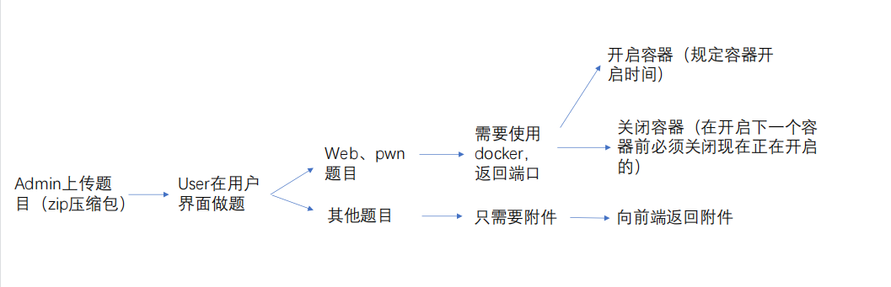

# EZBabyCTF

## 0. 小组成员

-   杜鑫：前端开发，人机交互
-   陆君睿：后端开发，功能实现
-   张靖宇：后端开发，题目搜集，效果测试

## 1. 项目概要设计

 仿照开源项目[CTFd](https://github.com/CTFd/CTFd)，利用HTML、JS、CSS、PHP、MySQL技术栈开发一个**全新的**能完成CTF日常练习基本功能的网站。经本组成员讨论研究决定要实现的功能包括但不限于：

-   普通用户：登录(signin.html)、登出(signout.html)、注册(signup.html)；查看并查找团队、可以选择加入的团队(teams.html)；查看团队计分板(scoreboard.html)；查看题目、下载附件、提交FLAG(challenges.html)；查看团队邀请录用信息(notifications.html)；给管理员留言(message.html)；修改密码(settings.html)
-   队长：在普通用户的基础上可以创建解散战队、对战队成员进行管理包括邀请新成员、删除无关成员(team.html)；修改密码(settings.html)
-   管理员：在普通用户的基础上可以创建题目(add.html)、修改创建过的题目信息(edit.html)

拟在此基础上添加WP展示和题目讨论功能，目前尚未形成一致意见。


## 2. 项目详细设计

[项目](https://github.com/EternalMemory672/EZBabyCTF.git)已上传至github，并根据实时进度进行更新。

### 2.1 目录结构

``` text
EZBabyCTF$ tree -L 3
.
├── Js
│   ├── axios.js
│   ├── core.js
│   ├── load.js
│   ├── mask.js
│   ├── md5.js
│   └── tpef.js
├── README.md
├── acceptinvite.php
├── add.html
├── admin
│   ├── add.html
│   └── add.php
├── attaches
│   ├── 1.jpg
│   ├── 2.jpg
│   ├── 3.png
│   └── 各用户所拥有的功能.pdf
├── challenge.php
├── challenges
│   ├── BlockChain
│   │   ├── EasyFJump
│   │   └── HackChain
│   ├── Crypto
│   │   ├── Uncommon Factors I
│   │   └── Uncommon Factors II
│   ├── Misc
│   │   ├── CheckIn
│   │   ├── Monopoly
│   │   ├── RCTF_CoolCat
│   │   └── misc_ezshell
│   ├── Pwn
│   │   ├── Pokemon
│   │   ├── catch_the_frog-pwn-docker
│   │   ├── ezheap
│   │   ├── game
│   │   ├── musl
│   │   ├── pwn_warmnote
│   │   ├── sharing-pwn-docker
│   │   └── unistruct-pwn-docker
│   ├── RCTF WriteUp By Nu1L-2.pdf
│   ├── README.md
│   ├── Recv
│   │   ├── Harmony
│   │   ├── LoongArch
│   │   ├── Valgrind
│   │   ├── dht
│   │   ├── sakuretsu
│   │   └── two_shortest
│   └── Web
│       ├── CandyShop
│       ├── EasyPHP
│       ├── EasySQLi
│       ├── README.md
│       ├── VerySafe
│       ├── hiphop
│       ├── ns_shaft_sql
│       └── xss_it
├── close_docker.php
├── createteam.php
├── css
│   ├── basic.css
│   └── primer.css
├── ezbabyctf.sql
├── flag.php
├── fonts
│   ├── UbuntuMono-B.ttf
│   ├── UbuntuMono-BI.ttf
│   ├── UbuntuMono-R.ttf
│   ├── UbuntuMono-RI.ttf
│   └── 方正小标宋简体.ttf
├── img
│   └── -bg.jpg
├── index.html
├── index.php
├── invitemember.php
├── notifications.html
├── notifications.php
├── open_docker.html
├── open_docker.php
├── removemember.php
├── removeteam.php
├── scoreboard.html
├── scoreboard.php
├── settings.php
├── signin.php
├── signup.php
├── team.html
├── team.php
├── teams.html
├── teams.php
└── test.php
```

### 2.2 数据库结构

```mysql
mysql> use ezbabyctf # 数据库名称
Database changed
mysql> show tables;
+---------------------+
| Tables_in_ezbabyctf |
+---------------------+
| challenges          | # 用于存储题目信息
| done                | # 用于记录用户做完的题目
| notifications       | # 用于储存用户间发送的信息
| scoreboard          | # 用于记录战队分数
| teams               | # 用于储存战队信息
| users               | # 用于储存用户信息
+---------------------+
mysql> desc challenges;
+----------+--------------+------+-----+---------+-------+
| Field    | Type         | Null | Key | Default | Extra |
+----------+--------------+------+-----+---------+-------+
| id       | varchar(10)  | NO   |     | NULL    |       | # 题目编号
| name     | varchar(100) | NO   |     | NULL    |       | # 题目名称
| category | varchar(100) | NO   |     | NULL    |       | # 题目分类：Web，Pwn，Re
| message  | text         | NO   |     | NULL    |       | # 题目描述信息
| value    | int(11)      | NO   |     | NULL    |       | # 题目分值
| flag     | varchar(100) | NO   |     | NULL    |       | # 题目的flag
| file     | varchar(100) | NO   |     | NULL    |       | # 题目文件的储存url（若有）
+----------+--------------+------+-----+---------+-------+
mysql> desc done;
+-----------+-------------+------+-----+---------+-------+
| Field     | Type        | Null | Key | Default | Extra |
+-----------+-------------+------+-----+---------+-------+
| id        | varchar(32) | NO   |     | NULL    |       | # 用户id用以标识用户身份
| challenge | varchar(32) | NO   |     | NULL    |       | # 题目编号
+-----------+-------------+------+-----+---------+-------+
mysql> desc notifications;
+---------+--------------+------+-----+---------+-------+
| Field   | Type         | Null | Key | Default | Extra |
+---------+--------------+------+-----+---------+-------+
| from    | varchar(100) | NO   |     | NULL    |       | # 发送的用户
| to      | varchar(100) | NO   |     | NULL    |       | # 接收的用户
| message | text         | NO   |     | NULL    |       | # 信息内容
+---------+--------------+------+-----+---------+-------+
mysql> desc scoreboard;
+-------+--------------+------+-----+---------+-------+
| Field | Type         | Null | Key | Default | Extra |
+-------+--------------+------+-----+---------+-------+
| id    | varchar(32)  | NO   |     | NULL    |       | # 战队id
| tname | varchar(100) | NO   |     | NULL    |       | # 战队名
| score | int(11)      | NO   |     | NULL    |       | # 战队得分
+-------+--------------+------+-----+---------+-------+
mysql> desc teams;
+---------+--------------+------+-----+---------+----------------+
| Field   | Type         | Null | Key | Default | Extra          |
+---------+--------------+------+-----+---------+----------------+
| id      | varchar(32)  | NO   | PRI | NULL    | auto_increment | # 战队id
| tname   | varchar(100) | NO   |     | NULL    |                | # 战队名
| captain | varchar(100) | NO   |     | NULL    |                | # 战队队长
| active  | char(1)      | YES  |     | 1       |                | # 战队状态（是否激活）
+---------+--------------+------+-----+---------+----------------+
mysql> desc users;
+----------+--------------+------+-----+---------+-------+
| Field    | Type         | Null | Key | Default | Extra |
+----------+--------------+------+-----+---------+-------+
| id       | varchar(32)  | NO   |     | NULL    |       | # 用户id
| name     | varchar(20)  | NO   |     | NULL    |       | # 用户名
| team     | varchar(100) | NO   |     | NULL    |       | # 用户所属战队
| password | varchar(32)  | NO   |     | NULL    |       | # 用户密码以MD5方式存储
+----------+--------------+------+-----+---------+-------+
```
2021年10月7日更新

----
### 2.3交互流程


```text
Create Virtul Host directory......
set permissions of Virtual Host directory......
You select the exist rewrite rule:/usr/local/nginx/conf/rewrite/other.conf
Test Nginx configure file......
nginx: the configuration file /usr/local/nginx/conf/nginx.conf syntax is ok
nginx: configuration file /usr/local/nginx/conf/nginx.conf test is successful
Reload Nginx......
Reload service php-fpm  done
Add database Sucessfully.
================================================
Virtualhost infomation:
Your domain: www.ezbabyctf.org
Home Directory: /home/wwwroot/www.ezbabyctf.org
Rewrite: other
Enable log: yes
Database username: ezbabyctf
Database userpassword: ezbabyctf
Database Name: ezbabyctf
Create ftp account: no
================================================
ubuntu password: ********
mysql root password : null
```

### 2.4 题目



admin上传题目：

```php
<?php
function unzip_file(string $zipName, string $dest)
{
	if (!is_file($zipName)) {

		return false;
	}
	if (!is_dir($dest)) {
		echo "error";
		mkdir($dest, 0777, true);
	}

	$zip = new ZipArchive();

	if ($zip->open($zipName)) {

		$zip->extractTo($dest);

		$zip->close();

		return true;
	} else {

		return false;
	}
}

$allowedExts = array("zip");
$temp = explode(".", $_FILES["file"]["name"]);

$extension = end($temp);     // 获取文件后缀名
if (($_FILES["file"]["type"] == "application/x-zip-compressed") && ($_FILES["file"]["size"] < 204800) && in_array($extension, $allowedExts)) {
	if ($_FILES["file"]["error"] > 0) {
		echo "错误：: " . $_FILES["file"]["error"] . "<br>";
	} else {

		$cmd = "find / -name " . $_POST["type_name"];
		$path = substr(shell_exec($cmd), 0, -1) . "/" . $_FILES["file"]["name"];


		if (file_exists($path)) {
			echo $_FILES["file"]["name"] . " 文件已经存在。 ";
		} else {
			move_uploaded_file($_FILES["file"]["tmp_name"], $path);
			echo "文件存储在: " . $path;
		}
	}
} else {
	echo "非法的文件格式";
}
$no_extension_name = str_replace(".zip", "", $_FILES["file"]["name"]);

$cmd2 = "cd ../challenges/" . $_POST["type_name"] . " && mkdir " . $no_extension_name;
shell_exec($cmd2);
$path2 = "../challenges/" . $_POST["type_name"] . "/" . $no_extension_name;
unzip_file($path, $path2);

$cmd3 = "rm ../challenges/" . $_POST["type_name"] . "/" . $_FILES["file"]["name"];
shell_exec($cmd3);
?>
```

web题目开启docker

```php
<?php

$path = "./challenges/" . $_POST["type_name"] . "/" . $_POST["challenge_name"] . "/docker-compose.yml";
$content = file_get_contents($path);
$Num = mt_rand(20000, 30000);
$before = '/\d{1,}:\d{1,}/';
preg_match($before, $content, $match);
$after = $Num . ':3000';
$content = str_replace($match, $after, $content);
file_put_contents($path, $content);
$cmd1 = "cd ./challenges/" . $_POST["type_name"] . "/" . $_POST["challenge_name"] . "&& sudo docker-compose up -d";//正常
$output=shell_exec($cmd1);

echo "192.168.223.131:" . $Num;

?>
```

2021年10月19日更新

------

### 2.5 界面

#### 2.5.1 鸣谢：primer 和 jQuery 以及前端前言

​		界面的设计基本风格源自[CTFd](https://github.com/CTFd/CTFd)以及开发过程中使用`jQuery`以及`primer.css`辅助开发，大大减少网页样式以及Javascript的代码量。但是作为初学者还是不可避免地写了非常多非常复杂并且**缺乏注释**的HTML代码。但这篇README.md会尽可能对代码进行解释，望大家海涵。直至我写这段话时，仅仅写了一部分`index.html`、`add.html`并且功能都尚未完成。但已经完成的是用户管理部分。

#### 2.5.2 index.html

##### 2.5.2.1 第一部分：**每次**在**进入页面的瞬间**需要加载的

```javascript
$(document).ready(function () {})
```

​		使用jQuery提供的加载函数优于JavaScript的`window.onload=function(){}`原因如下：

			1. `window.onload=function(){}`不能同时写多个，后面的将会覆盖前面的。
   			2. `window.onload=function(){}`在页面所有元素（包括图片，引用文件）加载完后执行。


- 用户是否已经登录：通过`cookie`实现

  ```javascript
  if ($.cookie("salt") != undefined) {
          var date = new Date();
          var now = date.getTime();
          var code = $.cookie("salt");
          if (Number(code.substring(32)) <= now) {
            flag = 100;                                    //flag的用途将在2.5.2.2中说明
            $(".logon").show();
          }
          else {
            $(".logout").show();
          }
  
        }
        else {
          $(".logout").show();
        }
  ```

  

- 用户是否是管理员：通过`cookie`调取用户名，向后端发起带有用户名的请求，得到是管理员的答复后开放题目管理入口

  ```javascript
  // 这里使用的是直接在 admin.html 文件上加验证，不再在 index.html 上验证，避免用户直接通过url进行跳转
  // 所以这个功能已经作废。现在的网页上任何登录的用户能看到 "出题" 一按钮但是点击进入后会被重定向回 index.html
  // 实现代码详情见 2.5.3 admin.html
  ```


- 检查：所有弹窗`class="popwindow"`、`class="pophint"`是否处于关闭状态

- 加载所有按钮：登录、注册、修改密码、登出、排行榜、战队、消息、出题

  检查弹窗幕布`class="marsk-container"`是否处于不显示状态

  ```javascript
  $(document).ready(function () {
        $(".Header-link").click(function () {
          $(".marsk-container").show();
        })
        $(".marsk-container").click(function () {
          $(".marsk-container").hide();
          $(".popwindow").hide();
          $(".pophint").hide()
        })
      })
  ```

  ​		上面代码中的弹窗和弹出提示`class="popwindow"`、`class="pophint"`都比较复杂，将会在后文中讲到。这里举一下弹窗幕布的例子：

  ```html
   <div class="marsk-container"></div>
  ```

  ```css
  .marsk-container {
    position: absolute;
    position: fixed;
    top: 0;
    right: 0;
    left: 0;
    bottom: 0px;
    background: rgba(0, 0, 0, 0.5);
    z-index: 10;
    display: none;
  }
  ```

  ​		要求弹窗幕布要在弹窗出现时出现，达到背景变暗的效果，在幕布存在的情况下，只要点击弹窗意外的任何地方，都能够使得弹窗隐藏。

  JavaScript实现代码如下：

  ```javascript
  $(document).ready(function () {
      $(".popwindow").click(function () {
          $(".marsk-container").show();
      })
      $(".marsk-container").click(function () {
          $(".marsk-container").hide();
          $(".popwindow").hide();
          $(".pophint").hide()
      })
  })
  ```

  

- 加载所有按钮：登录、注册、修改密码、登出、排行榜、战队、消息、出题

  以下是**HTML**代码

  ```html
  <div class="Header" style="background-color: rgba(0, 0, 0, 0.826)">
      <div class="Header-item m-auto">
        <span id="Head">EZBabyCTF</span>
      </div>
      <div class="Header-item m-3">
        <span class="Header-link" id="notif">通知 </span>
      </div>
  
      <div class="Header-item m-3">
        <span class="Header-link" id="team">战队</span>
      </div>
      <div class="Header-item m-3">
        <span class="Header-link" onclick="">排行榜</span>
      </div>
      <div class="Header-item m-3 logout">
        <span class="Header-link" onclick="signp()">注册</span>
      </div>
      <div class="Header-item m-3 logout">
        <span class="Header-link" onclick="signi()">登录</span>
      </div>
      <div class="Header-item m-3 logon">
        <span class="Header-link" id="chapas">修改密码</span>
      </div>
      <div class="Header-item m-3 logon">
        <span class="Header-link" id="signo">登出</span>
      </div>
    </div>
  ```

  ​		在上面的HTML代码中，分别用`class="logon"`和`class="logout"`标识出**登录状态**以及**未登录状态**要显示的导航栏按钮，除此之外还有导航栏上不同的按钮对应的id用于触发事件以及理清逻辑。

  ```javascript
        $("#signo").click(function () {
          if (flag != 100) {
            window.alert("请先登录！");
            return;
          }
          else {
            $.removeCookie('salt');
            window.location.reload();
          }
  
        })
        $("#chapas").click(function () {
          if (flag != 100) {
            window.alert("请先登录！");
            return;
          }
          $("#changepass").show();
          typing("#changepassipt", 2000);
  
        })
        $("#team").click(function () {
          if (flag != 100) {
            window.alert("请先登录！");
            return;
          }
          window.location.href = "team.html";
  
        })
        $("#notif").click(function () {
          if (flag != 100) {
            window.alert("请先登录！");
            return;
          }
          window.location.href = "notifications.html";
  
        })
  ```

- 加载题目，尚在开发中

  ```javascript
  ```

  

##### 2.5.2.2 第二部分：用户状态标识、注册、登录、修改密码

###### 用户状态标识：flag

```javascript
$(document).ready(function () {
      var flag = 0;
      ……
```

​		在网页加载的时候，一个负责记录用户状态的变量被定义：它用来记录用户的账户状态。它用于快捷地在网站打开状态下的JavaScript自行判断用户的账户状态。在涉及重要事务比如管理员账户设置还是需要cookie和后端交流。判断规则如下：

```html
  0：注册初始状态
  1：注册用户名
  2：注册密码
  3：确认密码
  10：登录初始态
  11：登录用户名
  12：登录密码
  100：登陆成功
  101：修改密码
  102: 确认旧密码
  103：确认新密码
```


设置`var flag`的初衷是为了**配合本网站特质的注册登录界面**


​		预期涉及本网站的注册、登录、修改密码的操作都由图所示的对话框来完成。根据对话框的提示，用户依次输入需要提交的部分。同时由网站输出的话会有`typing`的特效。因为提交框只设置了一个，因此不得不对每次的用户提交做辨析。因此不得不**引入flag来标志用户的这一步输入是什么内容**。

​		因此通过flag来标志用户的状态成为本网站的一个特色，也成为一个可能**被攻击的薄弱点**。

下面是flag的具体应用：

登录注册的核心JavaScript函数：确定按钮的点击事件

```javascript
	$(".push").click(function push() {
        $(".push").attr("disabled", "disabled");
        if (($("#signin").css("display") == "none") && ($("#signup").css("display") == "none")) {
          var doing = "#changepassipt";
          if (flag < 100 || flag > 104) {
            window.alert('error:2');
            return;
          }
        }
        else if (($("#signup").css("display") == "none") && ($("#changepass").css("display") == "none")) 		 {
          var doing = "#signinipt";
          if (flag < 10) {
            flag = 10;
          }
        }
        else if (($("#signin").css("display") == "none") && ($("#changepass").css("display") == "none")) 		 {
          var doing = "#signupipt";
          if (flag > 9) {
            flag = 0;
          }
        }
        var app = $(doing).val();
        var toappd = $(doing).parent().parent().find(".text-js");
        toappd.append("<p>>" + app + "<p/>");
        flag++;
        var ret = {
          content: "",
          flag: 0
        };
        setTimeout(function () {
          director(app, flag, ret);
          toappd.removeAttr("class");
          toappd.append("<p class='text-js'>>" + ret.content + "<p/>");
          flag = ret.flag;
          typing(doing, 4000);
        }, 1000);
        $(doing).val("");
        if (flag == 12) {
          setTimeout(() => {
            window.location.reload();
          }, 2000);
        }
      });
```

里面调用了几个外部的函数：

- `director(val, flag, ret)`这是整个用户管理的核心导航函数，会根据传入的flag的不同进行不同的操作，val是用户输入的字符串，ret是一个用于返回网站答复的对象，它有两个属性：

```javascript
var ret = {
          content: "",                                               //接收下一句需要显示的提示
          flag: 0                                                    //设定新的flag的值
        };
```

- `typing(ipt,speed)`这是打印特效需要的函数，会根据正在工作的弹窗（用参数ipt标出）和打印速度对具有`class="text-js"`属性的HTML元素施加打印特效。

